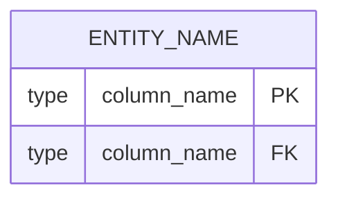

# [Feature ID]: Technical Design

## 1. Meta

| Attribute | Details |
|---|---|
| **Feature ID** | US-XX |
| **Version** | v1 |
| **Status** | Draft / Approved / Superseded / Rejected |
| **Requirements Version** | US-XX-<slug>.v1.md |
| **Approved By** | Human / Not approved |
| **Approved At** | YYYY-MM-DD |

## 2. Architecture

Describe the affected Clean Architecture layers:

- Domain
- Application
- Infrastructure
- Presentation

## 3. Database Schema Additions



## 4. API Contract

```yaml
Endpoint: POST /api/example
Auth: Required
Request:
  body:
    field: string
Response:
  201:
    id: string
```

## 5. Class / Interface Signatures

```php
interface ExampleInterface
{
    public function execute(string $input): DtoResult;
}
```

## 6. Failure Modes

| Failure | Expected Behavior |
|---|---|
| [Failure condition] | [Expected behavior] |

## 7. Symbol Map Changes

List all new or modified:

- Routes
- Controllers
- Classes
- Interfaces
- Database tables
- Other globally significant symbols

## 8. Security Considerations

- Authentication
- Authorization
- Input validation
- Session handling
- Redirect validation
- Sensitive data handling

## 9. Revision History

| Version | Date | Change | Reason |
|---|---|---|---|
| v1 | YYYY-MM-DD | Initial design | Initial approved requirements |