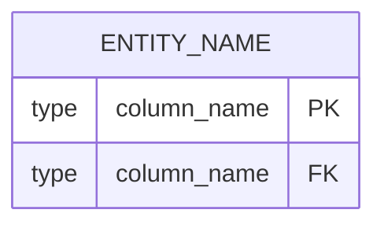

# [Feature ID]: Technical Design

## 1. Database Schema Additions (Mermaid ERD)


## 2. API Contract (YAML)
```yaml
Endpoint: POST /api/example
Auth: Required (Bearer)
Request:
  body:
    field: string (required)
Response:
  201:
    id: string
```

## 3. Class/Interface Signatures (PHP 8.4)
```php
interface ExampleInterface {
    public function execute(string $input): DtoResult;
}
```